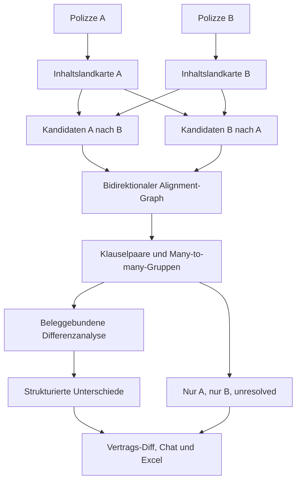

# Codex Umsetzungsidee 1

## Bidirektionaler Vertrags-Diff auf Klausel- und Inhaltsgruppenebene

Stand: 25. August 2026
Status: unabhängiger detaillierter Umsetzungsvorschlag; isolierter synthetischer PoC inklusive AnythingLLM-Agent-Skill ausgeführt, keine Produkt- oder Fachfreigabe
Priorität: Vergleich von zwei Gebäudeversicherungspolizzen
Nebenmodus: strukturiertes Inhaltsprofil einer einzelnen Polizze

---

## Versuchsnachweis

Die Kernmechanik wurde isoliert unter
[`strategy-pocs/codex-contract-diff`](../strategy-pocs/codex-contract-diff/README.md)
umgesetzt und über einen echten lokalen AnythingLLM-Chat ausgelöst. Der
vollständige Lauf, die 16 Diff-Zeilen, die katalogfremde Discovery und der
kandidatenbasierte 276er Partner-Crosswalk stehen im
[`E2E-TESTBERICHT`](../strategy-pocs/codex-contract-diff/E2E-TESTBERICHT.md).
Das ist Versuchsevidenz, keine Übernahme in den Produktcode.

---

## 1. Kurzfassung

Diese Umsetzungsidee beginnt nicht mit einer Excel-Liste oder einem festen
Partnerkatalog. Sie behandelt zwei Polizzen wie zwei komplexe Versionen eines
Vertragsinhalts und erzeugt einen intelligenten Vertrags-Diff.

Beide Dokumente werden zunächst vollständig in belegbare Inhaltsgruppen
zerlegt:

- Kapitel,
- Klauseln,
- Tabellenbereiche,
- Definitionen,
- Verweise,
- Fortsetzungen,
- Varianten- und Geltungsbereiche.

Danach sucht das System für jede Inhaltsgruppe aus Polizze A die fachlich
wahrscheinlich korrespondierende Gruppe in Polizze B. Anschließend wird die
Suche in Gegenrichtung von B nach A wiederholt. Dadurch entsteht kein rein
einseitiger Vergleich. Jede Inhaltsgruppe endet sichtbar als:

- eindeutig zugeordnet,
- mehreren Gruppen zugeordnet,
- nur in A beobachtet,
- nur in B beobachtet,
- oder nicht sicher zuordenbar.

Qwen erhält nur kleine, bereits zusammengestellte Klauselpaare oder
Klauselgruppen und beschreibt deren konkrete Unterschiede. Code besitzt die
Quellen, Gruppenzuordnung, Vergleichseinheiten und Ergebniszeilen.

Der zentrale Grundsatz lautet:

> Nicht ein bekannter Fragenkatalog entscheidet zuerst, was im Vertrag
> relevant ist. Zuerst wird der tatsächliche Inhalt beider Verträge
> vollständig gegeneinander ausgerichtet. Danach werden die belegten
> Unterschiede fachlich dargestellt und bei Bedarf Kategorien zugeordnet.

---

## 2. Bestätigtes Produktziel

### 2.1 Hauptziel

Der Kunde lädt zwei Gebäudeversicherungspolizzen hoch und erhält:

- eine nachvollziehbare Inhaltslandkarte beider Dokumente,
- korrespondierende Klauseln und Regelungen,
- konkrete Unterschiede innerhalb dieser Klauselpaare,
- Inhalte, die nur in einem der beiden Verträge vorkommen,
- unklare oder nicht sicher vergleichbare Stellen,
- physische Seiten und Originalquellen für jede Aussage,
- punktbezogene Vor- und Nachteile, sofern der Scope wirklich vergleichbar
  ist.

### 2.2 Nebenmodus mit einem Dokument

Mit nur einer Polizze erzeugt derselbe Kern:

- eine vollständige Klausel- und Inhaltslandkarte,
- belegte Inhaltsgruppen,
- Definitionen, Deckungen, Grenzen, Selbstbehalte, Bedingungen,
  Ausschlüsse und Obliegenheiten je Gruppe,
- Verweise und Fortsetzungen,
- ungeklärte oder widersprüchliche Bereiche.

Der Einzeldokumentmodus dient vor allem dazu, die Dokumenthälfte des späteren
A/B-Diffs vorzubereiten.

---

## 3. Warum ein Vertrags-Diff?

Ein fester Katalog ist gut darin, bekannte Fragen systematisch abzuarbeiten.
Er kann aber nur nach bereits bekannten Punkten fragen. Reale Polizzen können
zusätzliche oder ungewöhnliche Regelungen enthalten:

- versichererspezifische Erweiterungen,
- besondere Bedingungen,
- Nachträge,
- ungewöhnliche Unterlimits,
- abweichende Definitionen,
- kombinierte Klauseln,
- Regelungen ohne bekannte Katalogbezeichnung,
- mehrere Klauseln, die gemeinsam erst die tatsächliche Wirkung ergeben.

Ein Vertrags-Diff beginnt deshalb beim tatsächlichen Dokumentinhalt. Der
Partnerkatalog kann später als zusätzliche fachliche Ansicht darübergelegt
werden, ist aber nicht die primäre Suchgrenze dieses Ansatzes.

---

## 4. Grundidee an einem einfachen Beispiel

### Polizze A

```text
Klausel A17: Suchkosten sind bis AMOUNT_A je Schadenereignis gedeckt.
Klausel A18: Rohrersatz ist nur innerhalb des Gebäudes versichert.
```

### Polizze B

```text
Klausel B42: Kosten der Schadenortung werden bis AMOUNT_B ersetzt.
Klausel B43: Bruchschäden an Zu- und Ableitungsrohren auf dem Grundstück sind
mitversichert.
```

Der Vertrags-Diff soll erkennen:

```text
A17 <-> B42
Thema: Such-/Schadenortungskosten
Unterschied: andere Betragsgrenze oder Basis

A18 <-> B43
Thema: Rohrscope
Unterschied: A innerhalb des Gebäudes, B möglicherweise weiter auf dem
Grundstück; genaue Übergabepunkte prüfen
```

Dabei muss kein Katalogpunkt exakt `Schadenortungskosten` heißen. Die
Zuordnung entsteht aus Struktur, Wortlaut und Semantik beider Dokumente.

---

## 5. Gesamtworkflow



Der Workflow besteht aus sieben Phasen:

1. Dokumentbasis und Inhaltslandkarte A,
2. Dokumentbasis und Inhaltslandkarte B,
3. Kandidatenbildung A nach B,
4. Kandidatenbildung B nach A,
5. stabiler Alignment-Graph,
6. Differenzanalyse je Klauselpaar oder Klauselgruppe,
7. vollständige Vertrags-Diff-Ausgabe.

---

## 6. Phase 1 und 2: Inhaltslandkarte je Dokument

### 6.1 Primäre Einheiten

Jedes Dokument wird in stabile Vergleichseinheiten zerlegt. Eine Einheit kann
sein:

- eine nummerierte Klausel,
- ein Absatz unter einer fachlichen Überschrift,
- eine Tabellenzeile zusammen mit ihrem Tabellenkopf,
- eine Definition,
- eine Klauselfortsetzung über mehrere Seiten,
- ein Nachtrag oder eine besondere Bedingung,
- eine Gruppe aus Ausgangsklausel und notwendigem Querverweis.

Die physische Seite allein ist keine ausreichende Vergleichseinheit, weil eine
Seite mehrere Themen enthalten oder eine Klausel über mehrere Seiten laufen
kann.

### 6.2 Eigenschaften jeder Inhaltsgruppe

```json
{
  "documentId": "DOC-A",
  "contentGroupId": "CG-A-0017",
  "headingPath": ["Leitungswasser", "Kosten"],
  "clauseNumbers": ["17"],
  "physicalPages": [12],
  "blockIds": ["BLOCK-A-88", "BLOCK-A-89"],
  "tableContext": null,
  "variantScope": "Premium",
  "referenceTargets": [],
  "textSpanIds": ["SPAN-A-120"],
  "processingStatus": "ready_for_alignment"
}
```

### 6.3 Beziehungen innerhalb eines Dokuments

Die Inhaltslandkarte erhält typisierte Kanten:

- `parent_of`: Überschrift ist Parent einer Klausel,
- `continues_on`: Klausel setzt sich im nächsten Block oder auf der nächsten
  Seite fort,
- `table_header_for`: Tabellenkopf gilt für eine Zelle oder Zeile,
- `variant_of`: Regelung gehört zu einer bestimmten Deckungsstufe,
- `refers_to`: Klausel verweist auf eine andere Klausel,
- `overrides`: Nachtrag oder besondere Bedingung ändert eine Grundregel,
- `defines`: Definition erläutert einen verwendeten Begriff,
- `exception_to`: Ausnahme gehört zu einem Ausschluss.

Die Idee benötigt dafür keinen allgemeinen Wissensgraphen für die gesamte
Versicherungswelt. Es genügt ein begrenzter Dokumentbeziehungsgraph.

### 6.4 Terminale Verarbeitung

Jeder nichtleere Primärblock muss am Ende einen sichtbaren technischen Zustand
besitzen:

- Teil einer Inhaltsgruppe,
- Layout- oder Verwaltungsinhalt,
- bewusst ohne fachlichen Vertragsinhalt,
- noch nicht auflösbar,
- Verarbeitungsfehler.

Damit verschwinden unbekannte Klauseln nicht nur deshalb, weil sie keinem
Katalogthema entsprechen.

---

## 7. Phase 3 und 4: Kandidatenbildung in beide Richtungen

### 7.1 Warum bidirektional?

Eine einseitige Suche A nach B kann zusätzliche Inhalte in B übersehen. Darum
werden zwei vollständige Kandidatenmengen aufgebaut:

```text
für jede Inhaltsgruppe A_i:
  finde mögliche Gegenstücke in B

für jede Inhaltsgruppe B_j:
  finde mögliche Gegenstücke in A
```

Eine stabile Zuordnung ist stärker, wenn beide Richtungen einander bestätigen.

### 7.2 Kandidatensignale

Kandidaten werden aus mehreren Signalen gebildet:

#### Struktur

- gleiche oder ähnliche Überschriften,
- ähnliche Klauselnummern oder Klauselcodes,
- gleiche Position innerhalb einer Sparte,
- gleicher Tabellenaufbau,
- übereinstimmende Variantenbezeichnungen.

#### Sprache

- gleiche Schlüsselbegriffe,
- Synonyme,
- ähnliche Definitionen,
- ähnliche versicherte Sachen oder Gefahren,
- gleiche Geld-, Zeitraum- oder Bedingungssignale.

#### Semantik

- lokale Embedding-Ähnlichkeit der vollständigen Inhaltsgruppe,
- semantische Ähnlichkeit von Überschrift und Klauseltext getrennt,
- Ähnlichkeit der referenzierten Klauseln.

#### Beziehungen

- beide Gruppen verweisen auf vergleichbare Definitionen,
- beide sind Tabellenzeilen derselben fachlichen Funktion,
- beide sind Erweiterungen oder Ausnahmen einer Grundregel.

### 7.3 Kandidaten sind noch keine Paarung

Ein hoher semantischer Score allein beweist nicht, dass zwei Klauseln dieselbe
fachliche Funktion besitzen. Beispiel:

- eine Klausel nennt `EUR 20.000` als Jahreslimit,
- die andere nennt `EUR 350` als Selbstbehalt.

Beide können semantisch zum selben Schadensthema gehören, sind aber keine
direkten Gegenstücke derselben Geldfunktion.

### 7.4 Kein stilles Abschneiden

Für jede Inhaltsgruppe muss sichtbar bleiben:

- welche Kandidaten geprüft wurden,
- ob ein Kandidatenlimit überschritten wurde,
- ob eine eindeutige Zuordnung möglich war,
- ob menschliche oder modellgestützte Klärung nötig ist.

Eine nicht geprüfte Restmenge darf nicht als `kein Gegenstück` ausgegeben
werden.

---

## 8. Phase 5: Alignment-Graph

### 8.1 Zulässige Zuordnungsformen

| Form | Bedeutung |
| --- | --- |
| `1:1` | eine Klauselgruppe A entspricht einer Klauselgruppe B |
| `1:n` | eine kompakte Regel in A ist in B auf mehrere Gruppen verteilt |
| `n:1` | mehrere Regeln in A sind in B zusammengefasst |
| `n:m` | komplexe Regelungsgruppen müssen gemeinsam betrachtet werden |
| `only_a` | kein hinreichend bestätigtes Gegenstück in B |
| `only_b` | kein hinreichend bestätigtes Gegenstück in A |
| `unresolved` | Kandidaten vorhanden, Zuordnung aber nicht belastbar |

### 8.2 Paarungsentscheidung

Code kann sehr eindeutige Fälle direkt verbinden, beispielsweise:

- identischer Klauselcode und sehr ähnlicher Wortlaut,
- gleiche Überschrift und gleichartige Tabellenzeile,
- gegenseitig stärkster Kandidat mit kompatibler Funktion und Scope.

Mehrdeutige Fälle gehen als kleine Kandidatengruppe an Qwen. Das Modell
beantwortet nur:

```text
Welche dieser vorgegebenen Inhaltsgruppen regeln wahrscheinlich denselben
fachlichen Sachverhalt? Begründe ausschließlich mit den gelieferten Texten und
gib die festen Gruppen-IDs zurück. Wenn keine eindeutige Zuordnung möglich
ist, antworte unresolved.
```

### 8.3 Harte Grenzen

Eine Zuordnung ist unzulässig, wenn sicher erkennbar ist:

- andere Gefahr,
- andere versicherte Sache,
- andere Produktvariante,
- Definition versus Deckungsregel,
- Limit versus Selbstbehalt,
- Ausschluss versus Obliegenheit,
- Angebot versus nicht kompatibler Vertragsstand.

### 8.4 Quellenbesitz

Der Alignment-Graph referenziert ausschließlich bestehende Inhaltsgruppen und
Spans. Qwen kann keine neue Gruppe, Klausel oder Seite erzeugen.

---

## 9. Phase 6: Differenzanalyse je Paar oder Gruppe

### 9.1 Ziel

Nach der Zuordnung wird nicht mehr das ganze Dokument analysiert. Pro stabilem
Paar oder stabiler Gruppe lautet die Aufgabe:

```text
Welche konkreten Unterschiede bestehen zwischen diesen fachlich
korrespondierenden Vertragsstellen?
```

### 9.2 Strukturierte Differenzarten

Die Antwort wird in getrennte Felder aufgeteilt:

- Deckungsumfang,
- versicherte Sache,
- Definition,
- Auslöser oder Ursache,
- Limit oder Sublimit,
- Jahres- oder Ereignisaggregation,
- Selbstbehalt,
- Bedingung,
- Ausschluss,
- Ausnahme oder Wiedereinschluss,
- Obliegenheit,
- Rechtsfolge laut Vertragswortlaut,
- Variante,
- räumlicher oder zeitlicher Scope,
- Querverweis und Vertragsrang,
- sonstiger belegter Unterschied.

### 9.3 Beispielausgabe einer Differenzgruppe

```json
{
  "alignmentId": "ALIGN-0042",
  "groupIdsA": ["CG-A-0017"],
  "groupIdsB": ["CG-B-0042"],
  "topicCandidate": "Suchkosten",
  "differences": [
    {
      "differenceType": "limit",
      "valueA": "AMOUNT_A",
      "valueB": "AMOUNT_B",
      "scopeA": "je Ereignis",
      "scopeB": "je Ereignis",
      "evidenceIdsA": ["SPAN-A-120"],
      "evidenceIdsB": ["SPAN-B-402"]
    }
  ],
  "comparisonStatus": "comparable",
  "resolutionStatus": "resolved"
}
```

### 9.4 Gleichheit ist ebenfalls ein Ergebnis

Wenn zwei Gruppen fachlich gleich sind, wird dies gespeichert. So kann der
Bericht zwischen folgenden Fällen unterscheiden:

- wirklich gleich,
- nur sprachlich anders,
- teilweise unterschiedlich,
- nicht vergleichbar,
- nicht sicher gelöst.

### 9.5 `only_a` und `only_b`

Eine nur in A oder nur in B zugeordnete Klausel ist zunächst eine
beobachtete strukturelle Differenz. Daraus folgt nicht automatisch, dass die
entsprechende Deckung im anderen Vertrag fehlt. Möglich sind:

- anderer Wortlaut,
- anderer Querverweis,
- fehlender Vertragsbestandteil,
- übersehene oder ungelöste Zuordnung,
- tatsächliche zusätzliche Regelung.

Darum lautet die Darstellung zunächst beispielsweise:

```text
Regelung in A belegt; kein hinreichend bestätigtes Gegenstück in B gefunden.
Fachliche Schlussfolgerung: unresolved.
```

---

## 10. Phase 7: Vergleichsausgabe

### 10.1 Primäre Ansicht: Vertrags-Diff-Baum

```text
Dokument- und Variantenscope
├── zugeordnet und gleich
├── zugeordnet mit Unterschieden
├── nur in A beobachtete Gruppen
├── nur in B beobachtete Gruppen
└── ungelöste Zuordnungen

Feuer
├── Branddefinition: sprachlich anders, fachlich gleich
├── Implosion: unterschiedlicher Ausschlussstatus
├── Fahrzeuganprall: unterschiedliches Sublimit
└── unbekannte Erweiterung in B: fachliche Zuordnung offen

Leitungswasser
├── Rohrbruch/Folgeschaden: unterschiedlicher Scope
├── Suchkosten: anderes Limit
├── Selbstbehalt: andere Berechnungsbasis
└── Frostobliegenheit: nur in A eindeutig belegt
```

### 10.2 Fachliche Kategorien entstehen nach dem Diff

Die gefundenen Alignment-Gruppen können anschließend bekannten Kategorien
zugeordnet werden. Bleibt eine Gruppe katalogfremd, erscheint sie unter
`weitere belegte Vertragsunterschiede` statt verworfen zu werden.

### 10.3 Chatantwort

Der Benutzer kann fragen:

- „Zeige die wichtigsten Unterschiede.“
- „Welche Regelungen besitzt nur A?“
- „Welche Leitungswasserklauseln wurden miteinander verglichen?“
- „Warum wurde diese Klausel als nicht vergleichbar eingestuft?“
- „Zeige alle ungelösten Zuordnungen.“

Die Antwort wird aus gespeicherten Alignment- und Differenz-IDs aufgebaut.

### 10.4 Excel-Export

Empfohlene Tabellenblätter:

#### `Klausel_Diff`

| Spalte | Inhalt |
| --- | --- |
| Alignment-ID | stabile Vergleichsgruppe |
| Kategorie | nachträgliche fachliche Zuordnung |
| Struktur A | Überschrift/Klausel A |
| Seite A | physische Seite |
| Struktur B | Überschrift/Klausel B |
| Seite B | physische Seite |
| Zuordnungsform | 1:1, 1:n, n:1, only_a, only_b, unresolved |
| Unterschiedstyp | Limit, Scope, Ausschluss usw. |
| Aussage A | belegte strukturierte Aussage |
| Aussage B | belegte strukturierte Aussage |
| Vergleich | A/B/gleich/nicht vergleichbar/unresolved |
| Begründung | aus festen Quellen aufgebaute Erklärung |
| Reviewstatus | ungeprüft, bestätigt, zu klären |

#### `Nur_A`

Alle Inhaltsgruppen ohne hinreichend bestätigtes Gegenstück in B.

#### `Nur_B`

Alle Inhaltsgruppen ohne hinreichend bestätigtes Gegenstück in A.

#### `Unresolved`

Mehrdeutige Kandidaten und nicht abschließend vergleichbare Gruppen.

#### `Quellen_A` und `Quellen_B`

Alle verwendeten Spans, Seiten, Klauseln und Tabellenbezüge.

#### `Coverage`

Jede Primärgruppe beider Dokumente und ihr terminaler Alignmentstatus.

---

## 11. Vorgeschlagene Modulstruktur

### Modul: `PolicyContentMapBuilder`

**Rolle:** Orchestrierung und Transformation
**Aufgabe:** Erzeugt aus genau einem Dokument die vollständige
Inhaltslandkarte.

**Eingaben:** kanonische Seiten, Textblöcke und Layoutinformationen
**Ausgaben:** Content Groups und interne Beziehungen
**Nicht verantwortlich:** Vergleich mit einem zweiten Dokument.

### Modul: `ContentGroupSegmenter`

**Rolle:** Transformation
**Aufgabe:** Bildet stabile Klausel-, Tabellen- und Verweisgruppen.

**Fehlerzustände:** unklare Grenze, unaufgelöste Fortsetzung, beschädigte
Tabelle.

### Modul: `DocumentRelationResolver`

**Rolle:** Transformation
**Aufgabe:** Erzeugt Beziehungen wie Fortsetzung, Tabellenkopf, Verweis,
Definition und Override innerhalb eines Dokuments.

### Modul: `AlignmentFeatureBuilder`

**Rolle:** Transformation
**Aufgabe:** Erzeugt pro Inhaltsgruppe Struktur-, Sprach-, Semantik- und
Beziehungsmerkmale für den Abgleich.

### Modul: `ForwardAlignmentCandidateFinder`

**Rolle:** Transformation
**Aufgabe:** Findet für jede A-Gruppe mögliche B-Gruppen.

### Modul: `ReverseAlignmentCandidateFinder`

**Rolle:** Transformation
**Aufgabe:** Findet für jede B-Gruppe mögliche A-Gruppen.

### Modul: `BidirectionalAlignmentResolver`

**Rolle:** Entscheidung
**Aufgabe:** Verbindet beide Kandidatenrichtungen und erzeugt 1:1-,
Many-to-many-, only- und unresolved-Gruppen.

### Modul: `AlignmentAmbiguityAdapter`

**Rolle:** Modellgrenze
**Aufgabe:** Legt Qwen nur vorgegebene mehrdeutige Kandidatengruppen zur
Zuordnung vor.

### Modul: `ClauseDifferenceExtractor`

**Rolle:** Transformation
**Aufgabe:** Gewinnt aus stabilen Alignment-Gruppen konkrete strukturierte
Unterschiede.

### Modul: `DifferenceEvidenceValidator`

**Rolle:** Validierung
**Aufgabe:** Prüft alle A-/B-Quellen, Spans und Seiten sowie die Rückbindung
jedes Unterschiedsfelds.

### Modul: `DifferenceComparabilityGate`

**Rolle:** Entscheidung
**Aufgabe:** Prüft, ob aus einem beobachteten Unterschied ein relativer
Vorteil/Nachteil abgeleitet werden darf.

### Modul: `AlignmentCoverageLedger`

**Rolle:** Persistenz und Vollständigkeit
**Aufgabe:** Stellt sicher, dass jede Inhaltsgruppe aus A und B einen terminalen
Status besitzt.

### Modul: `ContractDiffRowPlanner`

**Rolle:** Orchestrierung
**Aufgabe:** Erzeugt sämtliche Ergebniszeilen aus Alignment- und
Differenzobjekten. Das LLM darf keine Zeile auswählen oder auslassen.

### Modul: `ContractDiffRenderer`

**Rolle:** Darstellung
**Aufgabe:** Rendert Diff-Baum, Chatantwort, Excel und Markdown aus derselben
Ergebnismenge.

---

## 12. Minimales Datenmodell

### `content_group`

- `group_id`
- `document_id`
- `group_type`
- `heading_path`
- `clause_numbers`
- `physical_pages`
- `block_ids`
- `variant_scope`
- `processing_status`

### `content_relation`

- `relation_id`
- `document_id`
- `source_group_id`
- `target_group_id`
- `relation_type`
- `evidence_ids`
- `resolution_status`

### `alignment_candidate`

- `source_document_id`
- `source_group_id`
- `target_document_id`
- `target_group_id`
- `direction`
- `structural_score`
- `lexical_score`
- `semantic_score`
- `role_compatibility`
- `scope_compatibility`
- `candidate_status`

### `alignment_group`

- `alignment_id`
- `group_ids_a`
- `group_ids_b`
- `alignment_type`
- `alignment_status`
- `reason`

### `clause_difference`

- `difference_id`
- `alignment_id`
- `difference_type`
- `value_a`
- `value_b`
- `scope_a`
- `scope_b`
- `evidence_ids_a`
- `evidence_ids_b`
- `resolution_status`

### `contract_diff_result`

- `result_id`
- `difference_id`
- `comparability_status`
- `comparison_status`
- `reason`
- `review_status`

---

## 13. Algorithmus als Pseudocode

```text
comparePolicies(documentA, documentB):
  mapA = ensureContentMap(documentA)
  mapB = ensureContentMap(documentB)

  candidatesAB = []
  for each groupA in mapA:
    candidatesAB += findCandidates(groupA, mapB)

  candidatesBA = []
  for each groupB in mapB:
    candidatesBA += findCandidates(groupB, mapA)

  alignments = resolveBidirectionalAlignments(
    mapA,
    mapB,
    candidatesAB,
    candidatesBA
  )

  for each alignment in alignments:
    if alignment is ambiguous:
      alignment = resolveBoundedAmbiguity(alignment)

    if alignment has groups on both sides:
      differences = extractStructuredDifferences(alignment)
      validateDifferenceEvidence(differences)
    else:
      differences = recordUnmatchedObservation(alignment)

  assertEveryContentGroupHasTerminalAlignmentState()

  comparisons = applyComparabilityRules(differences)
  rows = buildAllDiffRows(alignments, differences, comparisons)
  return renderContractDiff(rows)
```

---

## 14. Rolle von Code, Embeddings und Qwen

### Code

Code übernimmt:

- Zerlegung und IDs,
- Dokument- und Seitenbindung,
- vollständige Enumeration aller Inhaltsgruppen,
- Kandidatensignale,
- harte Ausschlussregeln für unvereinbare Funktionen,
- bidirektionale Zuordnungsmenge,
- Ergebniszeilen,
- Quellenvalidierung,
- Coverage- und unresolved-Status.

### Embeddings

Embeddings helfen dabei, sprachlich unterschiedliche Klauseln als Kandidaten
zusammenzubringen. Sie entscheiden aber nicht allein über fachliche Gleichheit
oder Vergleichbarkeit.

### Qwen

Qwen bearbeitet zwei begrenzte Aufgaben:

1. mehrdeutige Kandidatengruppen zuordnen oder `unresolved` melden,
2. aus bereits zugeordneten Klauselgruppen konkrete Unterschiede
   strukturiert formulieren.

Qwen verarbeitet nicht standardmäßig beide vollständigen PDFs in einem Prompt
und wählt keine Ergebniszeilen aus.

---

## 15. Effizienzstrategie

### Naiver Aufwand

Ein vollständiger Vergleich jeder A-Gruppe mit jeder B-Gruppe hätte ungefähr
quadratischen Aufwand. Bei vielen Klauseln wäre dies unnötig teuer.

### Mehrstufige Kandidatenbildung

1. harte strukturelle Filter: Dokumentart, Sparte, Variante,
2. schnelle lexikalische Übereinstimmung,
3. Überschriften- und Klauselcodevergleich,
4. semantische Kandidaten,
5. Rollen- und Scopekompatibilität,
6. Qwen nur für verbleibende Mehrdeutigkeit.

### Wiederverwendung

- Inhaltslandkarte pro Dokument einmal erzeugen,
- Embeddings und Merkmale pro Gruppe wiederverwenden,
- Alignment-Graph pro Dokumentpaar versionieren,
- spätere Chatfragen aus gespeicherten Diff-Objekten beantworten,
- nur geänderte Dokumentversionen neu verarbeiten.

### Ressourcen auf dem Kunden-Mac

- Modelloperationen seriell ausführen,
- Qwen-Aufrufe nach Alignment-Gruppen bündeln,
- keine gleichzeitige aktive Embedding- und Qwen-Inferenz,
- Checkpoints nach Inhaltslandkarte, Kandidatenbildung, Alignment und Diff,
- Laufzeit und Modellaufrufe pro Phase messen.

---

## 16. Teststrategie

### 16.1 Segmentierungstests

- Klauselfortsetzung über Seiten wird als eine Gruppe erkannt,
- zwei verschiedene Klauseln auf derselben Seite bleiben getrennt,
- Tabellenkopf und Variantenzelle bleiben verbunden,
- wiederholte Kopfzeile wird nicht zur Inhaltsgruppe,
- Nachtrag und geänderte Grundklausel bleiben verknüpft.

### 16.2 Alignmenttests

- identischer Inhalt mit anderen Begriffen wird gepaart,
- gleiche Begriffe mit anderer Funktion werden nicht gepaart,
- eine Klausel A zu mehreren Klauseln B ergibt `1:n`,
- zusätzliche B-Klausel wird durch den Rückwärtslauf entdeckt,
- fremde Variante wird nicht verbunden,
- mehrdeutige Kandidaten enden `unresolved`.

### 16.3 Differenztests

- höheres Limit bei gleicher Basis wird richtig erkannt,
- gleicher Betrag mit anderer Aggregation wird nicht als gleich ausgegeben,
- Selbstbehalt und Jahreslimit im selben Block bleiben getrennt,
- Ausschluss und Ausnahme werden als zwei verbundene Unterschiede behandelt,
- Bedingung im fremden Nachbarabsatz wird nicht zugerechnet,
- nur sprachlich andere Definition wird als gleichwertig erkannt.

### 16.4 Vollständigkeitstests

- jede Inhaltsgruppe A besitzt einen terminalen Alignmentstatus,
- jede Inhaltsgruppe B besitzt einen terminalen Alignmentstatus,
- kein Kandidatenüberlauf wird still abgeschnitten,
- keine Gruppe verschwindet wegen fehlender Katalogzuordnung,
- every-row/set-equality zwischen Alignments, Unterschieden und Ausgabe.

### 16.5 A/B-Golden Cases

Mindestens:

1. gleiche Klauseln mit anderer Nummerierung,
2. gleiche Bedeutung mit völlig anderer Formulierung,
3. eine Klausel A entspricht zwei Klauseln B,
4. AVB wird in A durch Nachtrag erweitert,
5. B enthält eine katalogfremde Zusatzdeckung,
6. A hat höheres Limit, B niedrigeren Selbstbehalt,
7. gleicher Betrag mit anderer Jahresbasis,
8. ungewählte Varianten stehen nebeneinander,
9. Tabellenkopf auf Vorseite,
10. WEG-Scope allgemeine Teile versus Innenausbau,
11. widersprüchliche Klauseln,
12. fehlender Vertragsbestandteil verhindert sichere Zuordnung,
13. gleiche Überschrift, aber andere versicherte Sache,
14. Cross-Reference verbindet mehrere Gruppen,
15. dichter Mehrbetragsfall mit Selbstbehalt und Jahreslimit.

### 16.6 Metriken

- korrekte Alignment-Paare,
- ausgelassene Soll-Paare,
- falsche Paarungen,
- richtig erkannte 1:n- und n:1-Gruppen,
- korrekte `only_a`-/`only_b`-Kandidaten,
- korrektes Abstain beziehungsweise unresolved,
- richtige Unterschiedsfunktion,
- richtige Wert-, Scope- und Variantenbindung,
- korrekte Seiten- und Quellenreferenzen,
- terminale Gruppenabdeckung,
- Laufzeit und Modellaufrufe.

---

## 17. Umsetzungsetappen

### Etappe 0: Synthetisches A/B-Diff-Oracle

Ein kleines, vollständig bekanntes Dokumentpaar mit:

- eindeutigen 1:1-Paaren,
- 1:n-Paaren,
- nur A und nur B,
- unbekannten Klauseln,
- Mehrbetrags- und Variantenfällen.

### Etappe 1: Inhaltsgruppen ohne LLM

PageMap, Überschriften, Klauseln, Tabellen und Fortsetzungen deterministisch
gruppieren. Ziel ist zunächst nicht perfekte Semantik, sondern stabile,
belegbare Einheiten.

### Etappe 2: Lexikalisch-struktureller Diff

Nur Struktur, FTS und kontrollierte Begriffe verwenden. Diese Baseline zeigt,
welche Paarungen ohne Embeddings und Qwen möglich sind.

### Etappe 3: Semantische Kandidaten

Dinghy additiv einsetzen und gegen das eingefrorene A/B-Oracle messen.

### Etappe 4: Bidirektionaler Resolver

A->B und B->A verbinden, Many-to-many und unresolved explizit machen.

### Etappe 5: Begrenzte Qwen-Paarprüfung

Nur mehrdeutige Kandidatengruppen und stabile Klauselpaare an Qwen geben.

### Etappe 6: Strukturierte Differenzen

Deckung, Definition, Betrag, Limit, Selbstbehalt, Bedingung, Ausschluss,
Obliegenheit und Scope getrennt extrahieren.

### Etappe 7: Vertrags-Diff-Ausgabe

Diff-Baum, Chatantwort und Excel aus derselben vollständigen Ergebnismenge
rendern.

### Etappe 8: Realistische lokale Holdouts

Mindestens mehrere strukturell unterschiedliche, lokal bleibende
Dokumentpaare einmal mit eingefrorenem Workflow prüfen.

---

## 18. Risiken und Gegenmaßnahmen

### Risiko: Semantisch ähnlich, aber fachlich nicht gleich

**Beispiel:** Limit und Selbstbehalt derselben Gefahr.
**Gegenmaßnahme:** Rollen- und Scopekompatibilität vor dem Pairing.

### Risiko: Eine Regelung ist über mehrere Klauseln verteilt

**Gegenmaßnahme:** 1:n-, n:1- und n:m-Alignment ausdrücklich erlauben.

### Risiko: Querverweise und Nachträge ändern die Bedeutung

**Gegenmaßnahme:** interne Dokumentrelationen vor dem A/B-Abgleich auflösen
und als Gruppe vergleichen.

### Risiko: `only_a` wird als fehlende Deckung in B missverstanden

**Gegenmaßnahme:** strukturelle Beobachtung und fachliche Negativaussage
getrennt halten; zunächst unresolved.

### Risiko: Zu viele mögliche Kandidaten

**Gegenmaßnahme:** mehrstufige Filter, sichtbarer Überlauf und begrenzte
Qwen-Gruppen statt globalem Top-N-Schweigen.

### Risiko: Dokumente besitzen stark unterschiedliche Gliederungen

**Gegenmaßnahme:** nicht nur Überschriften, sondern Wortlaut, Faktfunktion,
Tabellenstruktur, Semantik und Beziehungen verwenden.

### Risiko: Der Diff ist für den Makler zu dokumentnah

**Gegenmaßnahme:** nach dem vollständigen Diff fachliche Kategorien als
zusätzliche Ansicht zuordnen, ohne katalogfremde Unterschiede zu verlieren.

### Risiko: Schlechte serielle Laufzeit

**Gegenmaßnahme:** Merkmale und Embeddings einmal pro Gruppe, deterministische
Baseline vor Qwen und begrenzte Modellaufrufe pro ambiger Gruppe.

---

## 19. Offene Entscheidungen vor Implementierung

1. Wie wird eine stabile Inhaltsgruppe genau abgegrenzt?
2. Welche internen Dokumentrelationen sind für Version 1 zwingend?
3. Welche Signale dürfen eine 1:1-Paarung ohne Modell bestätigen?
4. Wann wird aus mehreren Kandidaten eine 1:n- oder n:m-Gruppe?
5. Wie groß darf eine Qwen-Alignmentgruppe werden?
6. Welche Differenzarten werden im ersten Pilot unterstützt?
7. Welche Kategorien dienen nur der Anzeige und welche beeinflussen das
   Pairing?
8. Wie wird ein fehlendes oder unvollständiges Vertragsdokument im Diff
   dargestellt?
9. Welche Laufzeit ist für einen vollständigen A/B-Diff akzeptabel?
10. Wie viele unresolved-Gruppen sind im Pilot akzeptabel?

---

## 20. Definition of Done für einen ersten belastbaren Pilot

Der Vertrags-Diff-Pilot gilt erst als belastbar, wenn:

- beide Dokumente vollständige, dokumentisolierte Inhaltslandkarten besitzen,
- jede Inhaltsgruppe A und B einen terminalen Alignmentstatus besitzt,
- die manuell erwarteten 1:1-, 1:n- und n:1-Paarungen erreicht werden,
- falsche Paarungen zwischen Limit, Selbstbehalt, Bedingung und Ausschluss
  verhindert werden,
- Varianten und versicherte Sachen getrennt bleiben,
- unbekannte katalogfremde Klauseln sichtbar bleiben,
- `only_a` und `only_b` nicht als automatische Nichtdeckung erscheinen,
- jede Differenz auf exakte A- und B-Quellen zurückführt,
- Qwen keine Gruppen oder Ergebniszeilen auswählen oder auslassen kann,
- Chat, Excel und Markdown dieselbe Ergebnismenge darstellen,
- Laufzeit und Modellaufrufe auf der vorgesehenen Hardware gemessen sind,
- ein fachlicher Reviewer das eingefrorene A/B-Oracle bestätigt hat.

---

## 21. Verhältnis zur kataloggetriebenen Idee

Diese Umsetzungsidee ist bewusst unabhängig von
`slavko_umsetzungsidee1.md`:

- Sie benötigt für die primäre Inhaltsfindung keine vollständige
  Vergleichspunktliste.
- Sie vergleicht zuerst tatsächliche Vertragsgruppen statt zuerst bekannte
  Fragen abzuarbeiten.
- Kategorien und Partnerpunkte werden nach dem Diff als fachliche Ansichten
  zugeordnet.
- Sie ist besonders stark beim Entdecken unbekannter Unterschiede.

Sie kann später mit einem Katalogansatz kombiniert werden, aber diese
Kombination wird nicht vorausgesetzt. Zunächst sollten beide Ansätze an
denselben anonymisierten A/B-Golden-Cases unabhängig gemessen werden.

Mögliche spätere Arbeitsteilung:

```text
Katalogpfad
-> beweist systematische Abarbeitung bekannter Fragen

Vertrags-Diff
-> sucht unbekannte und strukturell unerwartete Unterschiede

Gemeinsame Ergebnisschicht
-> vereinigt belegte Fakten ohne Duplikate oder Quellenverlust
```

---

## 22. Gesamturteil

Der bidirektionale Vertrags-Diff passt zum priorisierten Ziel, zwei Polizzen
detailliert zu vergleichen, und reduziert die Abhängigkeit von einer im Voraus
vollständigen Taxonomie. Seine größte Stärke ist das Entdecken unbekannter
oder versichererspezifischer Unterschiede. Seine größte technische
Herausforderung ist die fachlich korrekte Many-to-many-Zuordnung von Klauseln
bei unterschiedlichen Dokumentstrukturen.

Der Ansatz sollte deshalb nicht sofort als Vollprodukt implementiert werden.
Der erste sinnvolle Beweis ist ein kleiner, streng kontrollierter A/B-Pilot mit
manuell bekannten Klauselpaaren, zusätzlichen Klauseln auf beiden Seiten,
Varianten, Querverweisen und dem bekannten Mehrbetragsfehlerfall.

Diese Idee ist ein detaillierter Umsetzungsvorschlag. Sie ist noch keine
Entscheidung, den bestehenden Prototyp zu übernehmen oder die aktuelle
Evidenzaudit-Phase zu beenden.

---

## 23. Bezug zur Knowledge Base

Die Idee konkretisiert insbesondere:

- `INT-20260825-029`: A/B-Vergleich als aktuelle Produktpriorität,
- `INT-20260825-030`: bidirektionaler Klauselabgleich,
- `ADR-004`: Klauselstruktur statt starrer Seitenfenster,
- `ADR-005`: getrennte Rollen für Code, Dinghy und Qwen,
- `ADR-006`: terminale Coverage aller Primärblöcke,
- `ADR-007`: belegpositionsgebundene und mehrwertige Fakten,
- `ADR-012`: Server besitzt sämtliche Ergebniszeilen,
- `FAIL-001`: blockweises generatives Vollinventar skaliert nicht,
- `FAIL-003`: semantische Nähe beweist keine korrekte Rollenbindung,
- `FAIL-004`: freie monolithische Ein-Prompt-Ausgabe ist nicht belastbar.

---

## 24. Realer Umsetzungs- und Messstand vom 25. August 2026

Die unabhängige Idee wurde auf derselben lokalen, textnativen
21-Seiten-Quelle und gegen dieselben zwei Katalogquellen ausgeführt. Der
aktuelle Harness:

- verarbeitet 21/21 physische Seiten und hält 1.093 Inhaltszeilen im Ledger;
- filtert 63 wiederholte Randzeilen;
- erzeugt 35 terminale Strukturgruppen mit maximal 3.000 Zeichen;
- bricht bei einer einzelnen, nicht offsettreu teilbaren Überlängenzeile
  fail-closed ab;
- spiegelt jede Gruppe candidate-only gegen 153 bereinigte XLSX-Zeilen und
  276 Partner-Seed-Zeilen;
- benötigt im realen Struktur-/Crosswalk-Lauf null LLM-Aufrufe;
- erzeugt eine lokale Struktur-/Crosswalk-XLSX;
- besteht 18 fokussierte Tests.

Der Realtest deckte eine Fehlklassifikation vierstelliger Orts-/Adresszeilen
als Überschrift auf; sie ist korrigiert und regressionsgesichert. Der
Crosswalk bleibt bewusst nur Kandidat und erreichte bei fast jeder gematchten
Gruppe sein Top-K-Limit. Daher ist der Stand **nutzbar als unabhängiger
Struktur-/Discovery-/Auditpfad**, aber nicht als fachliche Fact-Extraktion und
noch nicht als realer Vertrags-Diff.
