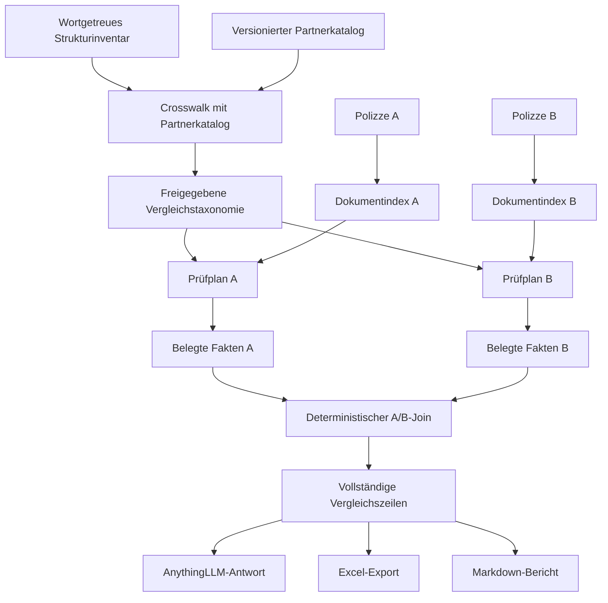

# Slavko Umsetzungsidee 1

## Katalog- und Excel-gesteuerter, occurrence-zentrierter Polizzenvergleich

Stand: 25. August 2026
Status: detaillierter Umsetzungsvorschlag; isolierter synthetischer PoC inklusive AnythingLLM-Agent-Skill ausgeführt, keine Produkt- oder Fachfreigabe
Priorität: Vergleich von zwei Gebäudeversicherungspolizzen
Nebenmodus: Analyse einer einzelnen Polizze

---

## Versuchsnachweis

Die Kernmechanik wurde isoliert unter
[`strategy-pocs/slavko-catalog-occurrence`](../strategy-pocs/slavko-catalog-occurrence/README.md)
umgesetzt und über einen echten lokalen AnythingLLM-Chat ausgelöst. Der
vollständige Lauf, 276/276 Partnerseed-Zeilen, der atomare 8-Punkte-Vergleich
und sämtliche Beweisgrenzen stehen im
[`E2E-TESTBERICHT`](../strategy-pocs/slavko-catalog-occurrence/E2E-TESTBERICHT.md).
Das ist Versuchsevidenz, keine Übernahme in den Produktcode.

---

## 1. Kurzfassung

Diese Umsetzungsidee baut eine gemeinsame, versionierte Vergleichsliste aus:

1. den tatsächlich in realen Polizzen beobachteten Kategorien,
   Unterkategorien, Klauseln und Tabellenbezeichnungen,
2. dem Partnerkatalog,
3. den für einen fachlichen A/B-Vergleich notwendigen Fragen und
   Antwortfeldern.

Für jede hochgeladene Polizze wird der Dokumentinhalt einmal strukturiert und
indexiert. Danach sucht Code für jeden ausgewählten Vergleichspunkt alle
relevanten Fundstellen im Dokument, erweitert jede Fundstelle auf den
zugehörigen Klausel- oder Tabellenkontext und gewinnt daraus belegte
Dokumentfakten. Qwen erhält nicht die Aufgabe, das gesamte Dokument frei zu
bewerten oder selbst Ergebniszeilen auszuwählen. Das Modell bearbeitet nur
kleine, bereits gefundene und zusammengehörige Textbereiche, wenn Code die
Bedeutung nicht eindeutig bestimmen kann.

Dokument A und Dokument B werden vollständig getrennt verarbeitet. Erst wenn
für beide Dokumente belegte Fakten vorliegen, vergleicht Code korrespondierende
Punkte und befüllt eine Excel-, Markdown- oder Chatdarstellung.

Der zentrale Grundsatz lautet:

> Die Vergleichsliste bestimmt, welche Fragen beantwortet werden müssen. Der
> Dokumentindex und das occurrence-zentrierte Retrieval bestimmen, welche
> Belege dazu gehören. Code besitzt die Ergebniszeilen; das LLM hilft nur beim
> Verstehen begrenzter Klauselkontexte und bei der Formulierung.

---

## 2. Bestätigtes Produktziel

### 2.1 Hauptziel: zwei Polizzen vergleichen

Der Benutzer lädt genau zwei Gebäudeversicherungspolizzen hoch. Das System:

1. analysiert Polizze A isoliert,
2. analysiert Polizze B isoliert,
3. ordnet die Fakten beider Dokumente denselben fachlichen Vergleichspunkten
   zu,
4. zeigt Gemeinsamkeiten und konkrete Unterschiede,
5. nennt punktbezogene Vor- und Nachteile,
6. belegt jede Aussage mit der jeweiligen Dokumentquelle,
7. kennzeichnet nicht vergleichbare und nicht eindeutig lösbare Punkte.

Das Ergebnis soll nicht bloß sagen, dass sich zwei Verträge unterscheiden. Es
soll erklären:

- worin der Unterschied besteht,
- für welche Gefahr, Sache und Variante er gilt,
- ob ein Betrag ein Limit, Sublimit, Selbstbehalt oder eine andere Geldrolle
  ist,
- welche Bedingungen, Ausschlüsse oder Obliegenheiten dazugehören,
- auf welcher physischen PDF-Seite und in welcher Klausel dies steht.

### 2.2 Nebenmodus: eine Polizze analysieren

Bei genau einem Dokument verwendet das System dieselbe Faktenermittlung, lässt
aber den A/B-Join weg. Es zeigt je Vergleichspunkt:

- belegte Leistungen,
- Definitionen,
- Grenzen und Selbstbehalte,
- Bedingungen und Ausschlüsse,
- Obliegenheiten,
- offene oder widersprüchliche Stellen.

Die Einzeldokumentanalyse ist damit kein getrenntes Produkt, sondern die
Dokumenthälfte des A/B-Vergleichs.

### 2.3 Was „besser“ zunächst bedeutet

„Besser“ wird nur punktweise verwendet. Beispiele:

- A hat im gleichen Scope ein höheres vergleichbares Sublimit als B.
- B hat im gleichen Scope einen niedrigeren vergleichbaren Selbstbehalt als A.
- A enthält eine belegte Erweiterung, die B ausdrücklich ausschließt.
- Beide Regelungen sind gleichwertig.
- Die Regelungen sind wegen unterschiedlicher Varianten oder Bezugsbasen nicht
  direkt vergleichbar.

Ohne bestätigtes Gebäude- und Risikoprofil gibt es keinen pauschalen
Gesamtsieger und keine automatische Gesamtpunktzahl.

---

## 3. Das zu lösende Problem

Ein einfacher RAG-Aufruf oder eine reine Wortsuche liefert nicht zuverlässig
alle relevanten Zusammenhänge:

- Ein Begriff kann an mehreren Stellen und in mehreren Sparten vorkommen.
- Der zugehörige Betrag kann vor oder nach dem Begriff stehen.
- Eine Bedingung kann im Folgesatz oder auf der nächsten Seite stehen.
- Tabellenüberschrift, Zeile und Variantenspalte können getrennt liegen.
- Eine Polizze kann auf AVB, besondere Bedingungen oder Nachträge verweisen.
- Versicherer verwenden unterschiedliche Bezeichnungen für denselben Inhalt.
- Mehrere Geldbeträge im selben Absatz können unterschiedliche Funktionen
  besitzen.
- Ein wichtiger Inhalt kann im Fließtext stehen, obwohl er keine eigene
  Überschrift besitzt.

Die Lösung darf deshalb weder nur nach Wörtern suchen noch das gesamte PDF in
einem einzigen großen Prompt durch Qwen bewerten lassen.

---

## 4. Begriffe in einfacher Sprache

### Vergleichspunkt

Eine fachliche Frage, die bei beiden Verträgen beantwortet werden soll, zum
Beispiel:

- Sind Suchkosten bei Leitungswasserschäden versichert?
- Welcher Selbstbehalt gilt bei Sturm?
- Sind Glasfassaden mitversichert?

### Antwortfeld

Ein einzelner Teil der Antwort. Für einen Vergleichspunkt können mehrere
Antwortfelder nötig sein:

- Deckung,
- versicherte Sache,
- Definition,
- Betrag oder Limit,
- Selbstbehalt,
- Bedingung,
- Ausschluss,
- Obliegenheit,
- Variante und Geltungsbereich,
- Quelle.

Diese Trennung verhindert, dass beispielsweise ein Jahreslimit als
Selbstbehalt ausgegeben wird.

### Occurrence beziehungsweise Fundstelle

Ein konkretes Vorkommen eines Suchbegriffs oder einer dazu passenden
Formulierung im Dokument. Mehrere Fundstellen desselben Begriffs bleiben
zunächst getrennt.

### Strukturkontext

Der fachlich zusammengehörige Bereich um eine Fundstelle:

- Satz oder Tabellenzelle,
- Klausel,
- Überschriftspfad,
- Tabellenkopf und Variantenspalte,
- belegte Fortsetzung auf der nächsten Seite,
- Querverweis auf eine andere Klausel.

### Dokumentfakt

Eine belegte Aussage aus genau einem Dokument, zum Beispiel:

```text
Leitungswasser / Selbstbehalt / 350 EUR / je Schadenereignis /
Variante Premium / physische Seite 4 / Klausel X
```

### Ergebniszeile

Die sichtbare Zeile im Vergleich. Eine Ergebniszeile kann mehrere belegte
Dokumentfakten zusammenfassen, darf diese aber nicht erfinden oder auslassen.

---

## 5. Gesamtworkflow



Der Workflow besteht aus sechs voneinander getrennten Phasen:

1. empirisches Strukturinventar und Katalog-Crosswalk,
2. Aufbau der Vergleichstaxonomie,
3. einmalige Dokumentaufbereitung,
4. occurrence-zentrierte Faktenermittlung je Dokument,
5. deterministischer A/B-Vergleich,
6. Chat-, Excel- und Markdown-Ausgabe.

---

## 6. Phase 1: Strukturinventar und Partner-Crosswalk

### 6.1 Eingangsdaten

- Ergebnis des laufenden wortgetreuen Strukturinventars,
- Partnerkatalog in seiner tatsächlich maßgeblichen Version,
- gegebenenfalls vorhandene Vergleichs-Excel,
- fachliche Rückmeldungen des Partners oder Maklers.

Die Anzahl der Partnerpunkte wird nicht vorausgesetzt. Ob eine Fassung 276,
290 oder eine andere Anzahl von Quellzeilen enthält, wird aus der konkreten
Katalogdatei festgestellt.

### 6.2 Qualitätsprüfung des Strukturinventars

Vor dem Crosswalk wird geprüft:

- Wurden alle PDFs und physischen Seiten verarbeitet?
- Gibt es Seiten mit fehlendem oder unbrauchbarem Text?
- Wurden Kopf- und Fußzeilen als falsche Kategorien gezählt?
- Wurden mehrzeilige Überschriften korrekt zusammengesetzt?
- Sind Klauselnummer und Klauseltitel richtig verbunden?
- Sind Tabellenüberschriften erfasst?
- Bleiben unklare Hierarchien als ungeklärt sichtbar?

### 6.3 Crosswalk-Ergebnisse

Jede beobachtete Originalbezeichnung und jeder Partnerpunkt kann folgende
Zuordnung erhalten:

| Status | Bedeutung |
| --- | --- |
| `gleich` | Inhalt und Granularität entsprechen sich |
| `ähnlich` | wahrscheinlich dasselbe Thema, fachliche Bestätigung nötig |
| `split` | ein Katalogpunkt muss in mehrere Vergleichspunkte geteilt werden |
| `merge` | mehrere Bezeichnungen gehören zu einem Vergleichspunkt |
| `fehlt_im_partnerkatalog` | real beobachteter Punkt ohne Kataloggegenstück |
| `nur_im_partnerkatalog` | Katalogpunkt ohne beobachtete Strukturbezeichnung |
| `regel_statt_dokumentfakt` | Zielwert, Empfehlung oder Brokerregel |
| `ungeklärt` | noch keine sichere Zuordnung |

### 6.4 Ergebnis dieser Phase

Der Crosswalk erzeugt noch keine Vertragsbewertung. Er liefert:

- eine empirische Liste der verwendeten Versicherersprache,
- Synonym- und Schreibvarianten,
- Kandidaten für stabile Vergleichspunkte,
- Hinweise auf zu grobe oder doppelte Partnerpunkte,
- eine Liste unbekannter oder ungeklärter Inhalte,
- die Basis für eine versionierte Vergleichstaxonomie.

---

## 7. Phase 2: Versionierte Vergleichstaxonomie

### 7.1 Warum eine Version nötig ist

Die Taxonomie wird sich weiterentwickeln. Ein früherer Analysebericht muss
später nachvollziehbar bleiben. Deshalb benötigt jede Fassung:

- `catalogId`,
- `version`,
- Erstellungsdatum,
- Freigabestatus,
- vollständige Liste stabiler Vergleichspunkt-IDs,
- Änderungsgrund zur Vorversion.

### 7.2 Beispiel eines Vergleichspunktvertrags

```yaml
comparisonPointId: LW-SUCHKOSTEN-001
category: Leitungswasser
displayOrder: 410
question: Sind Kosten für die Leckortung oder Schadenstellensuche gedeckt?
expectedAnswerFields:
  - coverage
  - insured_cost_type
  - limit
  - condition
  - exclusion
  - variant
  - evidence
searchAliases:
  - Suchkosten
  - Schadenortungskosten
  - Leckortung
  - Kosten der Feststellung der Schadenstelle
semanticHints:
  - Kosten zum Auffinden einer undichten Stelle
comparisonRules:
  requireSameScope: true
  comparableMoneyRole: limit
```

Dies ist nur eine synthetische Strukturillustration. Die endgültigen Punkte
und Begriffe benötigen fachliche Bestätigung.

### 7.3 Trennung von Frage und Antwort

Eine Vergleichsfrage darf mehrere Antworten pro Dokument erzeugen. Beispiel:

```text
Frage: Welche Selbstbehalte gelten bei Leitungswasser?

Antworten Dokument A:
- 350 EUR je Schadenereignis für Variante Premium
- 10 % mit Minimum X für Außenrohre

Antworten Dokument B:
- kein belegter Pauschalbetrag im geprüften Scope
- separater Selbstbehalt für Rückstau
```

Die sichtbare Excel-Zeile kann deshalb bei Bedarf in mehrere Unterzeilen
expandieren. Es wird nichts in eine einzige Freitextzelle gezwungen.

### 7.4 Kategorienreihenfolge

Die Ausgabe kann fachlich beispielsweise so aufgebaut werden:

1. Dokumentart, Version, Variante und Gültigkeit,
2. Versicherungsnehmer und versicherte Sachen,
3. Versicherungssumme und Bewertungsbasis,
4. Feuer,
5. Leitungswasser,
6. Sturm, Hagel und Schneedruck,
7. Elementar und Rückstau,
8. Glas,
9. Haftpflicht,
10. technische Anlagen und besondere Gebäudebestandteile,
11. Querschnitt: Limits und Selbstbehalte,
12. Querschnitt: Ausschlüsse, Bedingungen und Obliegenheiten,
13. Vertragsdauer, Kündigung und Prämienfakten,
14. offene, unbekannte und nicht zugeordnete Klauseln.

Diese Reihenfolge ist eine Darstellungsreihenfolge. Beim Lesen folgt das
System weiterhin dem tatsächlichen Dokumentfluss.

---

## 8. Phase 3: Einmalige Dokumentaufbereitung

Jede Polizze wird nur einmal technisch erschlossen. Spätere Fragen verwenden
denselben vorbereiteten Dokumentzustand.

### 8.1 Dokumenteinheiten

Das System erzeugt:

- physische PageMap,
- Textblöcke mit Originaloffsets,
- Überschriftenpfade,
- Klauselblöcke,
- Tabellen, Tabellenköpfe, Zeilen und Spalten,
- erkannte Fortsetzungen über Seiten hinweg,
- Querverweise,
- Dokumentart und Version,
- ausgewählte beziehungsweise mögliche Varianten,
- Suchindex für exakte Wörter und Phrasen,
- semantischen Index für Paraphrasenkandidaten.

### 8.2 Dokumentfluss bleibt erhalten

Jeder Block kennt mindestens:

- vorherigen und nächsten Block,
- übergeordnete Überschrift,
- physische Seite,
- zugehörige Tabelle oder Klausel,
- Variante und Geltungsbereich, soweit belegbar,
- Querverweise auf andere Blöcke.

Damit kann die spätere Suche nicht nur eine isolierte Textstelle, sondern den
fachlich verbundenen Dokumentbereich laden.

### 8.3 Wiederverwendung

Die Dokumentaufbereitung wird anhand des Dokumenthashs wiederverwendet. Eine
neue Nutzerfrage löst keinen vollständigen Neuimport aus, solange sich das
Dokument nicht verändert hat.

---

## 9. Phase 4: Occurrence-zentrierte Faktenermittlung

### 9.1 Prüfplan

Wenn eine vollständige A/B-Analyse verlangt wird, enumeriert Code alle
freigegebenen Vergleichspunkt-IDs. Bei einer gezielten Frage werden nur die
passenden Punkte ausgewählt.

Qwen darf diese Liste weder kürzen noch selbst neu sortieren.

### 9.2 Exakte Fundstellen

Für jeden Vergleichspunkt sucht FTS nach:

- exakten Begriffen,
- kontrollierten Schreibvarianten,
- bekannten Synonymen,
- kontrollierten Wortpräfixen,
- Klauselcodes oder Nummerierungen, wenn vorhanden.

Alle Treffer werden dokumentbezogen enumeriert. Es gibt für einen Pfad mit dem
Anspruch „alle“ keine globale Top-N-Kürzung.

### 9.3 Semantische Kandidaten

Dinghy ergänzt Textstellen, die denselben Inhalt anders ausdrücken. Beispiel:

```text
Katalogbegriff: Leitungswasser
Dokumentformulierung: bestimmungswidrig aus Rohrsystemen austretendes Wasser
```

Ein semantischer Treffer ist zunächst nur ein Kandidat. Er muss gegen den
Dokumenttext und den erwarteten fachlichen Scope geprüft werden.

### 9.4 Kontextaufbau pro Fundstelle

Der Kontext wird nicht als starres Fenster von beispielsweise 500 Wörtern
gebildet. Er wächst strukturell:

```text
Fundstelle
-> Satz oder Tabellenzelle
-> vollständige Klausel
-> Tabellenkopf, Zeile und Variantenspalte
-> belegte Fortsetzung
-> Überschrift und Geltungsscope
-> notwendiger Querverweis
```

Nachbarabsätze dürfen als Anzeigekontext erscheinen, werden aber nicht
automatisch als fachlich zugehörige Bedingungen übernommen.

### 9.5 Gewinnung der Antwortfelder

Code versucht zuerst eindeutig erkennbare Signale zu bestimmen:

- Geldbeträge und Währungen,
- Prozentwerte,
- Zeiträume,
- `je Ereignis`, `pro Jahr` oder andere Aggregationen,
- Negationen,
- Bedingungssignale wie `sofern`, `wenn` oder `vorausgesetzt`,
- Ausschlusssignale,
- Varianten- und Objektbezüge.

Danach werden diese Signale an die nächstliegende belegte fachliche Funktion
gebunden. Sind mehrere Zuordnungen möglich, bleibt der Punkt ungelöst oder die
kleine Klauselgruppe geht an Qwen.

### 9.6 Qwen-Aufgabe

Qwen erhält nur:

- eine feste Aufgaben-ID,
- die konkrete Frage,
- die erwarteten Antwortfelder,
- einen oder wenige zusammengehörige Klauselkontexte,
- die erlaubten Fundstellen-IDs.

Das Modell soll:

- die Bedeutung der Textstellen erklären,
- Werte und Bedingungen den richtigen Antwortfeldern zuordnen,
- Unsicherheit ausdrücklich angeben,
- ausschließlich belegte Quellen-IDs verwenden.

Das Modell soll nicht:

- das gesamte Dokument erneut durchsuchen,
- Punkte auswählen oder weglassen,
- Marktüblichkeit oder Empfehlungen erfinden,
- fehlende Fundstellen als fehlenden Versicherungsschutz ausgeben,
- neue Seiten oder Klauseln erfinden.

### 9.7 Ergebnis je Dokument

Für jeden Vergleichspunkt entstehen null bis mehrere Fakten:

```json
{
  "documentId": "DOC-A",
  "comparisonPointId": "LW-SUCHKOSTEN-001",
  "answerField": "limit",
  "value": "AMOUNT_A",
  "unit": "EUR",
  "basis": "je Schadenereignis",
  "scope": "Leitungswasser / ausgewählte Variante",
  "status": "supported",
  "evidenceIds": ["EVID-A-17"]
}
```

Originalwerte verbleiben in der lokalen Laufzeit. Das Beispiel verwendet
absichtlich einen Platzhalter.

---

## 10. Phase 5: Deterministischer A/B-Vergleich

### 10.1 Dokumentisolation

Bis zum Vergleichsschritt dürfen Fakten aus A und B nicht in denselben
Extraktionskontext gelangen. Jede Quelle, Seite, Variante und Fakt-ID gehört
eindeutig genau einem Dokument.

### 10.2 Vergleichbarkeitsprüfung

Vor einem Vorteil/Nachteil prüft Code mindestens:

- gleicher Vergleichspunkt,
- gleiche Antwortfunktion,
- gleiche Gefahr,
- gleiche versicherte Sache,
- kompatible Variante,
- kompatibler Zeitraum,
- gleiche Währung und Bezugsbasis,
- gleiche Aggregation, beispielsweise je Schaden oder pro Jahr.

### 10.3 Ergebniszustände

| Zustand | Bedeutung |
| --- | --- |
| `Vorteil A` | A ist im exakt vergleichbaren Punkt weiter oder günstiger |
| `Vorteil B` | B ist im exakt vergleichbaren Punkt weiter oder günstiger |
| `gleichwertig` | kein relevanter Unterschied im belegten Scope |
| `nicht vergleichbar` | Scope, Variante, Basis oder Funktion unterscheiden sich |
| `unresolved` | mindestens eine Seite ist nicht eindeutig geklärt |

### 10.4 Beispiele für Vergleichsrichtung

- Limit: höher kann innerhalb identischer Basis vorteilhaft sein.
- Selbstbehalt: niedriger kann innerhalb identischer Basis vorteilhaft sein.
- Ausschluss: ein ausdrücklicher Ausschluss kann gegenüber belegter Deckung
  nachteilig sein.
- Bedingung: weniger strenge Bedingungen können vorteilhaft sein, benötigen
  aber fachlich definierte Vergleichsregeln.
- Unterschiedliche Versicherungssummen oder Varianten: nicht automatisch
  vergleichbar.

### 10.5 Keine Schlussfolgerung aus bloßem Nichtfinden

Wenn A eine Deckung belegt und B dafür keinen eindeutigen Beleg liefert, lautet
das Ergebnis zunächst nicht `Vorteil A`, sondern beispielsweise:

```text
A: belegt
B: im geprüften Scope nicht eindeutig belegt
Vergleich: unresolved
```

---

## 11. Phase 6: Ergebnisdarstellung

### 11.1 Chatantwort

AnythingLLM zeigt zunächst eine verständliche Zusammenfassung:

- wichtigste belegte Unterschiede,
- punktbezogene Vorteile A und B,
- nicht vergleichbare Punkte,
- ungelöste beziehungsweise offene Punkte,
- Quellenzugriff pro Aussage.

Der Benutzer kann danach gezielt fragen:

- „Zeige alle Selbstbehalte.“
- „Warum ist A bei Leitungswasser besser?“
- „Welche Ausschlüsse besitzt nur Vertrag B?“
- „Zeige mir die Originalquellen für Glasfassaden.“

### 11.2 Excel-Arbeitsmappe

Empfohlene Tabellenblätter:

#### `Vergleich`

| Spalte | Inhalt |
| --- | --- |
| Kategorie | fachliche Hauptgruppe |
| Vergleichspunkt-ID | stabile technische ID |
| Frage | verständliche Prüffrage |
| Antwortfeld | Deckung, Limit, Selbstbehalt usw. |
| Scope | Gefahr, Sache, Variante, Zeitraum |
| Dokument A | belegte Antwort |
| Quelle A | Seite und Klausel |
| Dokument B | belegte Antwort |
| Quelle B | Seite und Klausel |
| Vergleich | A/B/gleich/nicht vergleichbar/unresolved |
| Begründung | deterministisch aufgebaute Erläuterung |
| Reviewstatus | ungeprüft, bestätigt oder zu klären |

#### `Fakten_A` und `Fakten_B`

Alle einzelnen Dokumentfakten, auch wenn mehrere Fakten dieselbe sichtbare
Vergleichsfrage beantworten.

#### `Offene_Punkte`

- fehlende oder unklare Vertragsbestandteile,
- widersprüchliche Klauseln,
- ungeklärte Varianten,
- unaufgelöste Verweise,
- notwendige fachliche Rückfragen.

#### `Quellen`

Alle verwendeten Fundstellen mit Dokument-ID, physischer Seite, Klausel,
Belegtext und zugehörigen Fakt-IDs.

#### `Laufstatus`

- Taxonomieversion,
- Modellversion,
- analysierte Dokumente,
- verarbeitete Seiten,
- vollständige und ungelöste Prüfaufträge,
- Laufzeit und Modellaufrufe.

### 11.3 Markdown-Bericht

Der Markdown-Bericht folgt derselben Kategorienreihenfolge, zeigt aber pro
Punkt kompakt:

```text
Vergleichspunkt
- Dokument A
- Dokument B
- Vergleichsergebnis
- Begründung
- Quellen A/B
- offene Fragen
```

Excel und Markdown sind abgeleitete Darstellungen. Die gespeicherten Fakten
und Quellen bleiben die maßgebliche Grundlage.

---

## 12. Vorgeschlagene Modulstruktur

### Modul: `StructureInventoryImporter`

**Rolle:** Quelle
**Aufgabe:** Liest die Ergebnisse des wortgetreuen Strukturinventars ein.

**Eingaben:** Inventarlauf, Dokument- und Strukturzeilen
**Ausgaben:** versionierte beobachtete Strukturbezeichnungen
**Seiteneffekte:** schreibt ausschließlich Crosswalk-Arbeitsdaten
**Fehler:** unvollständige Läufe werden nicht als vollständige empirische Basis
verwendet.

### Modul: `PartnerCatalogImporter`

**Rolle:** Quelle und Validierung
**Aufgabe:** Liest die konkret gewählte Partnerkatalog-Version und prüft IDs,
Duplikate und Zeilenanzahl.

**Eingaben:** Katalogdatei
**Ausgaben:** unveränderbarer Katalogsnapshot
**Fehler:** fehlende oder doppelte IDs blockieren die Aktivierung.

### Modul: `TaxonomyCrosswalkService`

**Rolle:** Transformation
**Aufgabe:** Verwaltet reversible Zuordnungen zwischen Originalstruktur,
Partnerpunkten und stabilen Vergleichspunkten.

**Eingaben:** Strukturinventar, Partnerkatalog, manuelle Reviewentscheidungen
**Ausgaben:** Crosswalk-Einträge
**Nicht verantwortlich:** Vertragsfakten extrahieren oder Punkte bewerten.

### Modul: `ComparisonTaxonomyRegistry`

**Rolle:** Quelle und Vertrag
**Aufgabe:** Liefert die aktive Taxonomieversion, Reihenfolge, Fragen,
Suchbegriffe, erwarteten Antwortfelder und Vergleichsregeln.

### Modul: `PolicyDocumentIngestor`

**Rolle:** Quelle und Orchestrierung
**Aufgabe:** Erzeugt PageMap, Blöcke, Klauseln, Tabellen und Suchindizes für
genau ein Dokument.

### Modul: `ComparisonPlanBuilder`

**Rolle:** Entscheidung
**Aufgabe:** Enumeriert bei einem Vollvergleich sämtliche aktiven
Vergleichspunkt-/Antwortfeld-IDs; bei einer gezielten Frage die passende
Teilmenge.

**Wichtige Regel:** Das Modell darf die geplanten IDs nicht verändern.

### Modul: `OccurrenceEnumerator`

**Rolle:** Transformation
**Aufgabe:** Findet alle kontrollierten exakten Vorkommen je Prüfauftrag.

### Modul: `SemanticCandidateFinder`

**Rolle:** Transformation
**Aufgabe:** Ergänzt semantische Paraphrasenkandidaten, ohne sichere
Negativentscheidungen zu treffen.

### Modul: `StructuralContextResolver`

**Rolle:** Transformation
**Aufgabe:** Baut aus einer Fundstelle den belegten Klausel-, Tabellen-,
Varianten- und Verweiskontext.

### Modul: `PolicyFactExtractor`

**Rolle:** Transformation
**Aufgabe:** Erzeugt getrennte Fakten für Deckung, Wert, Limit,
Selbstbehalt, Bedingung, Ausschluss und Obliegenheit.

### Modul: `AmbiguityReviewAdapter`

**Rolle:** externe Modellgrenze
**Aufgabe:** Sendet nur kleine ungelöste Klauselgruppen an Qwen und verlangt
Antworten für feste Aufgaben- und Fundstellen-IDs.

### Modul: `EvidenceValidator`

**Rolle:** Validierung
**Aufgabe:** Prüft, ob Quellen, Seiten, Offsets und Modellreferenzen im
kanonischen Dokument existieren.

### Modul: `DocumentFactStore`

**Rolle:** Persistenz
**Aufgabe:** Speichert versionierte, dokumentisolierte Fakten und Evidenzen.

### Modul: `ComparabilityGate`

**Rolle:** Entscheidung
**Aufgabe:** Entscheidet, ob zwei Fakten fachlich direkt verglichen werden
dürfen.

### Modul: `PolicyComparisonJoiner`

**Rolle:** Transformation
**Aufgabe:** Verbindet vergleichbare Fakten aus A und B und erzeugt den
punktweisen Vergleichsstatus.

### Modul: `ComparisonRowPlanner`

**Rolle:** Orchestrierung
**Aufgabe:** Besitzt sämtliche sichtbaren Ergebniszeilen und stellt sicher,
dass keine geplante oder validierte Fakt-ID verloren geht.

### Modul: `ComparisonReportRenderer`

**Rolle:** Darstellung
**Aufgabe:** Rendert Chat, Excel und Markdown aus derselben Zeilenmenge.

---

## 13. Minimales Datenmodell

### `comparison_catalog`

- `catalog_id`
- `version`
- `status`
- `created_at`

### `comparison_point`

- `point_id`
- `catalog_id`
- `category_id`
- `label`
- `question`
- `display_order`

### `point_answer_field`

- `point_id`
- `field_id`
- `field_type`
- `expected_unit`
- `comparison_direction`
- `required_scope_fields`

### `point_alias`

- `point_id`
- `alias`
- `alias_type`
- `review_status`

### `document_block`

- `document_id`
- `block_id`
- `physical_page`
- `start_offset`
- `end_offset`
- `heading_path`
- `table_id`
- `variant_scope`

### `occurrence`

- `occurrence_id`
- `document_id`
- `point_id`
- `block_id`
- `matched_text`
- `start_offset`
- `end_offset`
- `candidate_source`

### `document_fact`

- `fact_id`
- `document_id`
- `point_id`
- `field_id`
- `value`
- `unit`
- `basis`
- `scope`
- `status`
- `evidence_ids`

### `comparison_result`

- `comparison_id`
- `point_id`
- `field_id`
- `fact_ids_a`
- `fact_ids_b`
- `comparability_status`
- `comparison_status`
- `reason`

---

## 14. Orchestrierungslogik

```text
onPrompt(documents, userPrompt):
  mode = classifyPrompt(userPrompt, documentCount)
  taxonomy = loadActiveTaxonomy()

  for each document:
    basis = ensureDocumentBasis(document)

  plan = buildComparisonPlan(mode, userPrompt, taxonomy)

  for each document separately:
    for each planned target:
      exactOccurrences = enumerateAllExactOccurrences(target, document)
      semanticCandidates = findSemanticCandidates(target, document)
      contexts = resolveStructuralContexts(exactOccurrences + candidates)
      facts = extractAndValidateFacts(target, contexts)
      persistFacts(document, target, facts)

  if documentCount == 1:
    return renderSingleDocumentAnalysis(plan, factsA)

  comparisons = compareFacts(plan, factsA, factsB)
  rows = planAllResultRows(plan, comparisons)
  return render(rows)
```

Die tatsächliche Implementierung soll gemeinsame Kontexte und Fakten
wiederverwenden. Der Pseudocode bedeutet nicht, dass für jeden Prüfpunkt das
Dokument oder das Modell erneut vollständig aufgerufen wird.

---

## 15. Effizienz und Modellaufrufe

### Falscher Ausführungspfad

```text
jede Excel-Zeile
  x jeder Dokumentchunk
  x Dokument A und B
  x Qwen-Aufruf
```

Dieser Pfad wächst sehr schnell und erzeugt widersprüchliche Mehrfachanalysen
desselben Textes.

### Bevorzugter Ausführungspfad

```text
Dokument einmal indexieren
-> Fundstellen einmal sammeln
-> zusammengehörige Klauselkontexte einmal verstehen
-> gewonnene Fakten mehreren Vergleichszeilen zuordnen
-> A/B einmal deterministisch verbinden
```

Ein einziger Klauselkontext kann damit gleichzeitig Deckung, Limit,
Selbstbehalt und Bedingung beantworten.

### Laufzeitstrategie

- Dokumentbasis nach Upload vorbereiten oder beim ersten Bedarf erzeugen.
- Bereits fertige Basis anhand Dokumenthash wiederverwenden.
- Exakte Suche und Codeextraktion vor Modellaufrufen ausführen.
- Ambige Kontexte nach Klauselgruppe statt nach Excel-Zeile bündeln.
- Modelloperationen auf dem 32-GB-Mac seriell ausführen.
- Checkpoints setzen, damit ein Abbruch nicht den gesamten Lauf neu startet.

---

## 16. Teststrategie

### 16.1 Taxonomietests

- jede aktive Point-ID ist eindeutig,
- jede Zeile hat eine Kategorie und Reihenfolge,
- `split`- und `merge`-Crosswalks sind reversibel,
- Brokerregeln werden nicht als Dokumentfakten behandelt,
- neue unbekannte Dokumentpunkte können erfasst werden.

### 16.2 Fundstellentests

- mehrere Vorkommen desselben Begriffs werden einzeln gefunden,
- Paraphrase ohne exaktes Keyword wird als Kandidat erkannt,
- fremde gleichlautende Sparte wird nicht zugeordnet,
- Tabellen- und Seitenfortsetzungen bleiben erhalten,
- kein stilles Top-N schneidet Fundstellen ab.

### 16.3 Faktentests

- Selbstbehalt und Jahreslimit im selben Absatz bleiben getrennt,
- Prozentwert mit Minimum und Maximum wird richtig gebunden,
- Bedingung im Nachbarabsatz wird nur bei belegter Beziehung übernommen,
- Ausschluss und Ausnahme vom Ausschluss bleiben getrennt,
- ungewählte Varianten werden nicht der gewählten Variante zugerechnet.

### 16.4 A/B-Tests

- gleicher Punkt und gleicher Scope wird korrekt verglichen,
- gleicher Begriff mit unterschiedlicher Funktion wird nicht verbunden,
- nur in A belegt und B ungelöst erzeugt keinen automatischen Vorteil,
- gleicher Betrag mit anderer Jahres-/Ereignisbasis ist nicht vergleichbar,
- A- und B-Quellen werden niemals vermischt,
- mehrere Fakten pro Punkt bleiben vollständig sichtbar.

### 16.5 Realistische Golden Cases

Mindestens erforderlich:

- dichte Mehrbetragsklausel,
- Leitungswassertabelle mit Varianten,
- mehrseitige Tabelle,
- AVB plus besondere Bedingung oder Nachtrag,
- Cross-Page-Fortsetzung,
- WEG-Scope allgemeiner Teil versus Innenausbau,
- unbekannte katalogfremde Klausel,
- ausdrücklich nicht belegter Punkt,
- widersprüchliche Vertragsstellen,
- unterschiedliche Begriffe für denselben A/B-Punkt.

### 16.6 Abnahmemessungen

Getrennt messen:

- gefundene und ausgelassene Soll-Fundstellen,
- richtige und falsche Faktfunktion,
- korrekte Wert-/Bedingungs-/Variantenbindung,
- korrekte physische Seitenquelle,
- unresolved-Fälle,
- falsche A/B-Verbindungen,
- Laufzeit,
- Modellaufrufe,
- Wiederverwendung bei erneutem Prompt.

---

## 17. Umsetzungsetappen

### Etappe 0: Ergebnisse des Strukturinventars abnehmen

**Ergebnis:** technisch und stichprobenartig geprüfte empirische
Strukturliste.
**Noch nicht bewiesen:** fachliche Inhaltsvollständigkeit.

### Etappe 1: Lokaler Crosswalk

**Ergebnis:** reversible Zuordnung zwischen beobachteter Struktur und
Partnerkatalog.
**Entscheidung:** welche Partnerpunkte bleiben, werden geteilt, verbunden oder
ergänzt?

### Etappe 2: Kleiner Taxonomiepilot

Nicht sofort alle Kategorien umsetzen. Zuerst ein begrenzter, aber schwieriger
A/B-Pilot, beispielsweise:

- Dokument- und Variantenscope,
- Leitungswasser,
- Selbstbehalte und Limits,
- Bedingungen und Ausschlüsse.

**Ergebnis:** stabile Point- und Antwortfeld-IDs mit fachlichem Oracle.

### Etappe 3: Dokumentbasis und Occurrence-Kern

**Ergebnis:** PageMap, Clause Ledger, FTS, semantische Kandidaten,
Kontextresolver und vollständige Fundstellenliste.

### Etappe 4: Rollen- und Wertbindung

**Ergebnis:** belegte Dokumentfakten; insbesondere bestandener dichter
Selbstbehalt-/Limit-Fall.

### Etappe 5: A/B-Join und Excel-Prototyp

**Ergebnis:** zwei Dokumente werden isoliert analysiert und in einer festen
Vergleichsmatrix verbunden.

### Etappe 6: AnythingLLM-Integration

**Ergebnis:** Upload von A/B und normaler Chatprompt starten intern den
passenden Workflow; technische Buttons sind nicht erforderlich.

### Etappe 7: Kategorienbreite

Die Taxonomie wird schrittweise erweitert. Jede neue Kategorie verwendet
dieselben Modulverträge und erhält eigene Golden Cases, ohne den Kern zu
duplizieren.

---

## 18. Risiken und Gegenmaßnahmen

### Risiko: Der Partnerkatalog ist zu grob oder doppelt

**Gegenmaßnahme:** Crosswalk mit `split`, `merge` und stabilen neuen IDs.

### Risiko: Die Excel-Zeile wird mit einem Fakt gleichgesetzt

**Gegenmaßnahme:** null bis mehrere Fakten und expandierbare Unterzeilen
zulassen.

### Risiko: Begriff gefunden, Zusammenhang falsch verstanden

**Gegenmaßnahme:** struktureller Kontextresolver und getrennte Wert-, Rollen-
und Scopebindung.

### Risiko: Wichtiger Inhalt besitzt kein Katalogkeyword

**Gegenmaßnahme:** semantische Kandidaten plus separater Discovery-Restpass für
unbekannte Klauseln.

### Risiko: Zu viele Qwen-Aufrufe

**Gegenmaßnahme:** Dokument und Klauselgruppen einmal bearbeiten, Fakten
wiederverwenden, Qwen nur für Mehrdeutigkeit.

### Risiko: Ein Punkt erscheint in mehreren Gefahren

**Gegenmaßnahme:** Gefahr, Sache, Variante und Zeitraum sind Teil des Scopes;
kein Deduplizieren nur nach dem Wort `Selbstbehalt`.

### Risiko: Vergleich erzeugt vorschnell einen Gewinner

**Gegenmaßnahme:** Vergleichbarkeitsprüfung und punktweise Zustände statt
Gesamtscore.

---

## 19. Offene Entscheidungen vor Implementierung

1. Welche Partnerkatalog-Datei und Version ist maßgeblich?
2. Welche Punkte sind echte Dokumentfragen und welche sind Brokerregeln,
   Kundenfragen oder externe Informationen?
3. Welche Kategorien und Punkte bilden den ersten A/B-Pilot?
4. Welche Antwortfelder benötigt jeder Pilotpunkt?
5. Wann soll eine Excel-Zeile in mehrere Unterzeilen expandieren?
6. Welche Varianten und Vertragsbestandteile bilden ein vollständiges
   Dokumentpaket?
7. Welche Vergleichsrichtungen sind fachlich freigegeben?
8. Welcher unresolved-Anteil ist im Pilot akzeptabel?
9. Welche Laufzeit ist für einen vollständigen A/B-Vergleich akzeptabel?
10. Welche Ergebnisse müssen vor Kundennutzung manuell bestätigt werden?

---

## 20. Definition of Done für einen ersten belastbaren Pilot

Der Pilot gilt erst als belastbar, wenn:

- zwei Dokumente vollständig getrennt verarbeitet werden,
- die Pilot-Point-IDs vollständig und ohne LLM-Auswahl abgearbeitet werden,
- alle bekannten Fundstellen der Golden Cases gefunden oder sichtbar
  unresolved sind,
- Betrag, Selbstbehalt, Limit, Bedingung und Ausschluss korrekt getrennt sind,
- physische Seiten und Klauseln stimmen,
- A/B nur bei kompatiblem Scope verbunden wird,
- keine geplante Ergebniszeile fehlt,
- unbekannte Klauseln nicht still verworfen werden,
- der Excel-Export dieselben Fakten wie die Chatantwort enthält,
- Laufzeit und Modellaufrufe auf der vorgesehenen Kundenhardware gemessen sind,
- ein fachlicher Reviewer die ausgewählten A/B-Fälle gegen das lokale Oracle
  geprüft hat.

---

## 21. Gesamturteil

Die Umsetzungsidee ist gut mit dem Projektziel vereinbar und nutzt die
vorhandene Partnerarbeit, ohne die gesamte fachliche Entscheidung dem LLM zu
überlassen. Ihre größte Stärke ist die nachvollziehbare, planbare Abarbeitung
bekannter Vergleichspunkte. Ihr größtes Risiko besteht darin, den Katalog oder
die Excel versehentlich zur Grenze des Vertragsinhalts zu machen.

Deshalb muss die Architektur zwei Dinge gleichzeitig leisten:

1. jeden freigegebenen Vergleichspunkt vollständig und reproduzierbar
   abarbeiten,
2. unbekannte oder katalogfremde Vertragsinhalte weiterhin entdecken und
   sichtbar halten.

Diese Idee ist ein detaillierter Umsetzungsvorschlag. Sie ist noch keine
Entscheidung, den bestehenden Prototyp zu übernehmen oder mit der
Produktimplementierung zu beginnen.

---

## 22. Bezug zur Knowledge Base

Die Idee konkretisiert insbesondere:

- `INT-20260825-025`: wortgetreues Strukturinventar,
- `INT-20260825-026`: Trennung Struktur- und Inhaltsinventar,
- `INT-20260825-028`: taxonomiegetriebener occurrence-zentrierter
  A/B-Zeilenworkflow,
- `INT-20260825-029`: A/B-Vergleich als aktuelle Produktpriorität,
- `ADR-003`: occurrence-zentrierte exhaustive Suche,
- `ADR-004`: Klauselstruktur statt starrer Seitenfenster,
- `ADR-005`: getrennte Rollen für Code, FTS, Dinghy und Qwen,
- `ADR-012`: Server besitzt sämtliche Ergebniszeilen,
- `FAIL-003`: falsche Bindung mehrerer Geldrollen im selben Block,
- `FAIL-004`: instabile monolithische Ein-Prompt-Ausgabe.

---

## 23. Realer Umsetzungs- und Messstand vom 25. August 2026

Die Idee wurde als isolierter PoC auf einer lokalen, textnativen
21-Seiten-Quelle und einer Arbeitskopie der vorhandenen Referenz-XLSX
ausgeführt. Der aktuelle Harness:

- plant 153 bereinigte XLSX-Prüfzeilen und 276 Partner-Seed-Zeilen vollständig;
- enumeriert Occurrences codebasiert und hält `0..n` Fact-Kandidaten getrennt;
- zeigt ausgewählten Fact, Kandidatenanzahl und Mehrfachkandidaten sichtbar;
- bindet die Dinghy-Übergabe an Dokumentrolle sowie Dokument- und
  Katalogfingerprint;
- verwendet Qwen nur für eine begrenzte Candidate-Review-Stichprobe;
- erzeugt eine lokale, reviewfähige XLSX-Arbeitskopie;
- besteht 23 fokussierte Tests.

Gemessen wurden im Referenzlauf 58 lexikalische Kandidatenzeilen, 94
`not_evidenced`-Zeilen und ein konservativer semantischer Kandidat. Die
Qwen-Stichprobe bestand nur in 3/8 Fällen den formalen Validator; alle anderen
Fälle wurden fail-closed. Daher ist der Stand **nutzbar als interner
Kandidaten-/Reviewpfad**, aber **nicht** als fachlich beantwortete Polizze und
noch nicht als realer A/B-Vergleich.
